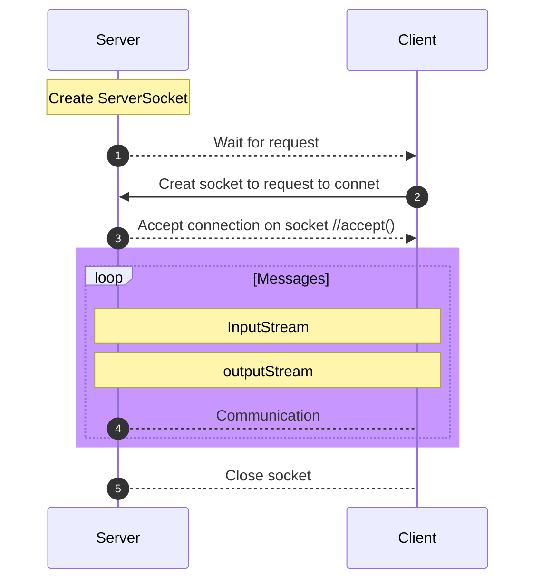
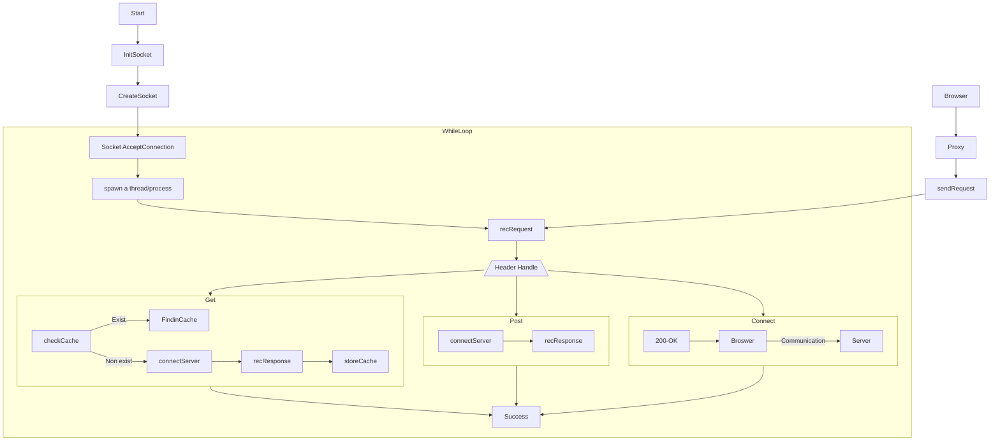

# HTTP-Caching-Proxy

# Instruction
Before implement, ensure you do not have conflict container and images, if you do, please do follow:
```
sudo docker ps -a
sudo docker images
sudo docker rmi <image_id>
```

if pop an error, then:
```
sudo docker stop <contain_id>
sudo docker rm <contain_id>
sudo dokcer rmi <image_id>
```
----
----
After git clone our repo, you should run (if you want to check logfile):
```
sudo docker-compose up -d
sudo docker ps
```
Paste your container ID, then
```
sudo docker exec -it <container_id> /bin/bash
cat proxy.log
```

Otherwise if you only want to visit web, you can directly run:
```
sudo docker-compose up
```


For this assignment you will be writing an http proxy – a server whose job it is to forward requests to the origin server on behalf of the client. Your proxy will cache responses, and, when appropriate, respond with the cached copy of a resource rather than re-fetching it.

# Table of Contents

- [Review](#Review)
  - [Socket](#Socket)
  - [Method](#Method)
- [Design Overview](#Design-Overview)
  - [Workflow](#Workflow)
- [Implementation](#Implementation)

## Review

### Socket

**What should Server do:** 
- Create a ServerSocket object and bind the listening port
- Call the accept() method to monitor the client's request
- After the connection is established, read the request information sent by the client through the input stream
- Send response information to the client through the output stream
- Close related resources

**What should Client do:**
- Create a Socket object, indicating the address and port number of the server to be linked
- After the link is established, send request information to the server through the output stream
- Get the server response information through the output stream
- Close related resources


- An HTTP "client" is a program that establishes a connection to a server for the purpose of sending one or more HTTP requests.  
- An HTTP "server" is a program that accepts connections in order to service HTTP requests by sending HTTP responses.

### Method

| Method  | Description | Response |
| ------------- | ------------- | ------------- |
| [Get](https://www.rfc-editor.org/rfc/rfc7231#section-4.3.1) | The GET method requests transfer of a current selected representation for the target resource. | **Cacheable** |
| [Post](https://www.rfc-editor.org/rfc/rfc7231#section-4.3.3)  | The POST method requests that the target resource process the representation enclosed in the request according to the resource's own specific semantics.  | **Cacheable** when they include [explicit freshness information](https://www.rfc-editor.org/rfc/rfc7234#section-4.2.1) |
| [Connect](https://www.rfc-editor.org/rfc/rfc7231#section-4.3.6)  | The CONNECT method requests that the recipient establish a tunnel to the destination origin server identified by the request-target and, if successful, thereafter restrict its behavior to blind forwarding of packets, in both directions, until the tunnel is closed.  | **Not Cacheable** |

### Error

- 400 Bad Request: the proxy receives a malformed request
- 502 Bad Gateway If it contacts the destination webserver and receives a corrupted response

## Design Overview

### Workflow



## Implementation

### Requirements
1. The proxy must **cache** responses to GET requests. (Caching is typically controlled by headers in the HTTP response, such as the "Cache-Control" header and the "Expires" header. These headers specify the caching policies for the response, such as how long the response can be cached and whether it can be reused.).    
**Implementation**:   
    &nbsp;&nbsp;Client Side Cache -- Hash Table(?).  
    &nbsp;&nbsp;Intermediate Cache(Proxy Server) -- utilize HTTP protocol.  
    &nbsp;
**Reference**:
&nbsp;&nbsp; - https://blog.csdn.net/zongzhiyuan/article/details/53700294
  


