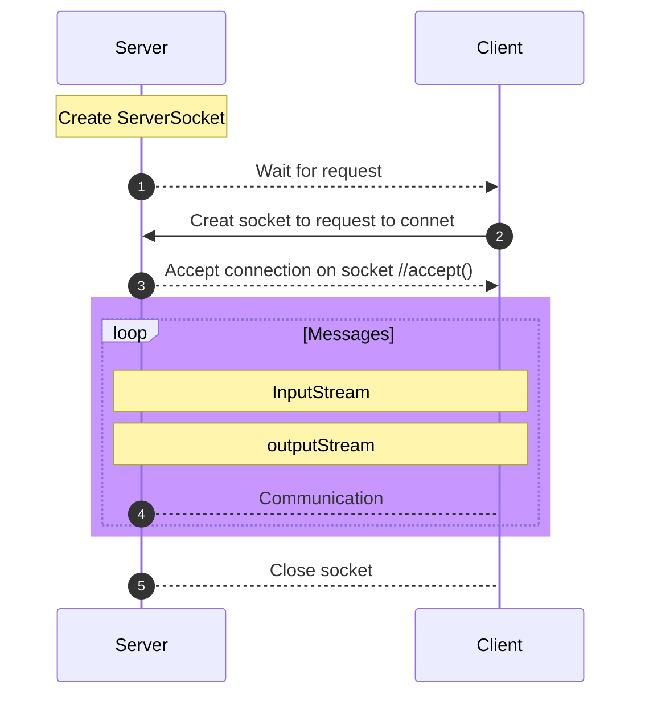

# HTTP-Caching-Proxy

For this assignment you will be writing an http proxy – a server whose job it is to forward requests to the origin server on behalf of the client. Your proxy will cache responses, and, when appropriate, respond with the cached copy of a resource rather than re-fetching it.

# Table of Contents

- [Review](#Review)
  - [Socket](#Socket)
- [Design Overview](#Design-Overview)
- [Implementation](#Implementation)

## Review

### Socket

**What should Server do:** 
- Create a ServerSocket object and bind the listening port
- Call the accept() method to monitor the client's request
- After the connection is established, read the request information sent by the client through the input stream
- Send response information to the client through the output stream
- Close related resources

**What should Client do:**
- Create a Socket object, indicating the address and port number of the server to be linked
- After the link is established, send request information to the server through the output stream
- Get the server response information through the output stream
- Close related resources

## Design Overview
## Implementation

### Requirements
1. The proxy must **cache** responses to GET requests. (Caching is typically controlled by headers in the HTTP response, such as the "Cache-Control" header and the "Expires" header. These headers specify the caching policies for the response, such as how long the response can be cached and whether it can be reused.).    
  **Implementation**: Client Side Cache -- Hash Table(?)
                      Intermediate Cache(Proxy Server) -- utilize HTTP protocol, 

